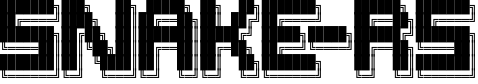
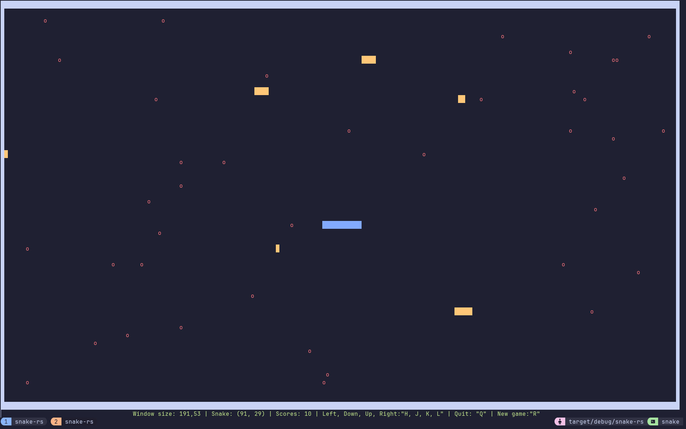

    

Snake-rs is a snake game written in rust. Aim to be played on the terminal whenever you have to wait for system update, ansible, build, etc... to finish.

---

# Motivation
After reading ["The Book"](https://doc.rust-lang.org/book/ "Title"), I wanted to make a simple stuff that could help me learn Rust.
And it reminds me that I had wrote a snake game in Python years ago for the same purpose.
But it was a little bit different this time, because I got proper Neovim + auto completion setup instead of Gedit.
So I was pretty much flying blindly with documentations on my fingertips and having some fun with Rust.
Here you go, another snake game.

 ---

# Installation
 1. Make sure you have Cargo installed on your system.
 2. Clone the repo: `git clone https://github.com/Rainbowpen/snake-rs.git`
 3. Go into the snake-rs directory: `cd snake-rs`
 4. Run it with Cargo: `Cargo run`

 ---

# Screenshot

